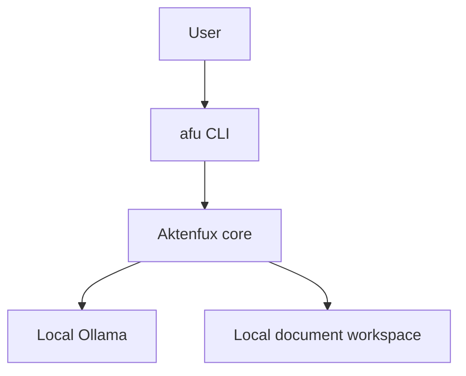
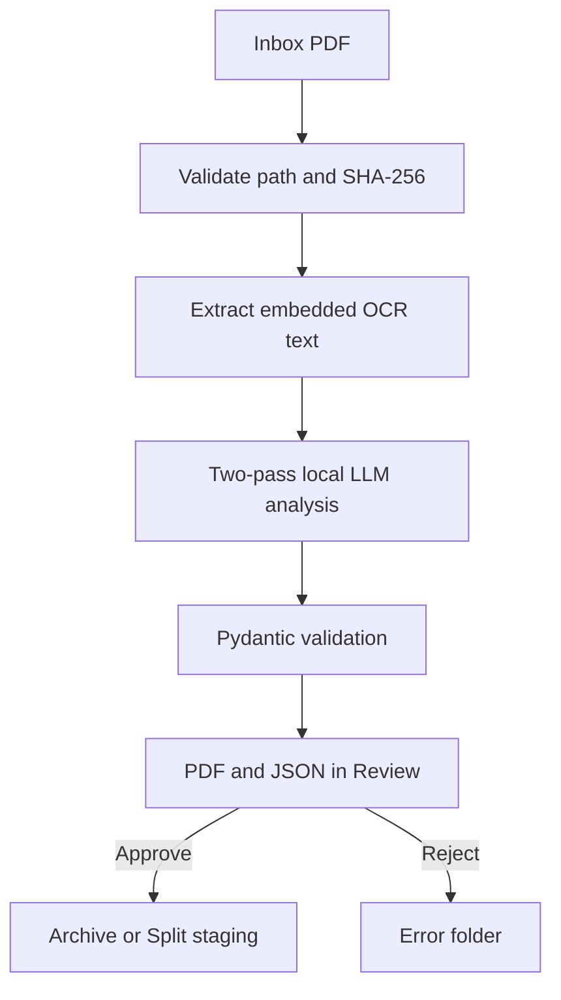
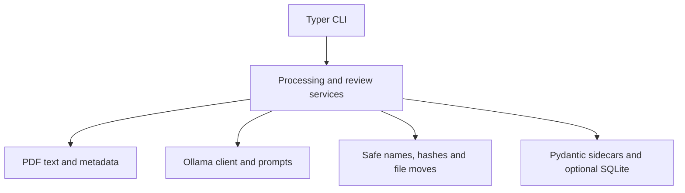
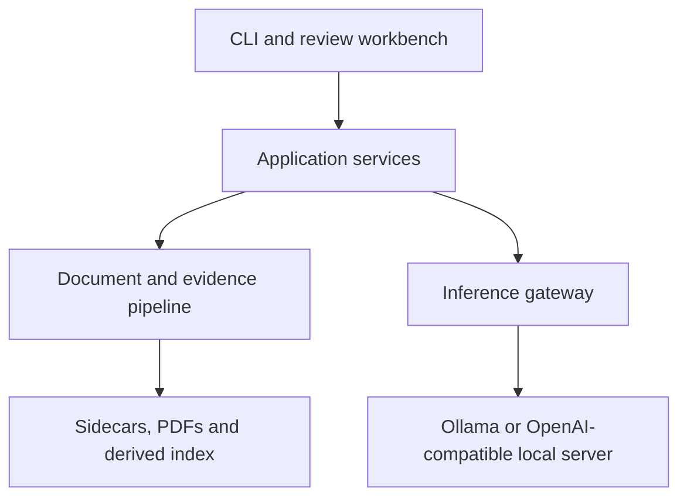

# Aktenfux architecture

This document describes the architecture currently present on the main branch and
keeps proposed extensions visibly separate. Aktenfux is a local, privacy-first
document pipeline: sidecar JSON is authoritative, SQLite is optional, and a human
must approve permanent archival actions.

## Current system context

<!-- diagram: system-context -->

The CLI is the current user interface on main. The browser workbench exists in
draft pull request 14 and is therefore not represented as a current component.

## Current processing flow

<!-- diagram: document-flow -->

Dry-run follows the same decision path without moving the original document.
A document recommended for splitting is staged for explicit follow-up; Aktenfux
does not silently split it.

## Current components

<!-- diagram: components -->

| Component | Responsibility |
| --- | --- |
| config.py | Configuration and workspace paths |
| pdf_text.py and pdf_metadata.py | Embedded OCR text and optional PDF metadata |
| llm.py and ollama_manager.py | Prompting, local inference and model checks |
| schema.py | Validated document analysis and sidecar contract |
| storage.py and filenames.py | Hashing, safe paths, names and moves |
| db.py | Rebuildable optional index; never the source of truth |
| main.py and review.py | Processing, approval, rejection and reprocessing |
| cli.py | User commands and terminal presentation |

## Data ownership and trust boundaries

| Data | Authority | Rebuildable | Notes |
| --- | --- | --- | --- |
| Original PDF | Local filesystem | No | Preserve and back up |
| Sidecar JSON | Source of truth | No | Human-readable audit trail |
| SQLite index | Derived index | Yes | Must never contain unique state |
| LLM response | Untrusted input | Yes | Validate before file operations |
| Archive path | Derived proposal | Yes | Apply only after approval |

The Ollama endpoint is local by default. Configuring a LAN endpoint changes the
network boundary and must remain an explicit operator decision.

## Planned evolution

The following target is not yet the implementation on main.

<!-- diagram: target-architecture -->

The inference gateway should hide provider-specific request formats while
preserving the local-only default. This enables Qwen 3.8-27B without coupling the
document domain to Ollama. Page-level evidence should accompany extracted facts
so summaries and decisions can be traced back to their source.

## Near-term roadmap

1. Resolve the two older open branches before extending main:
   pull request 13 for index rebuilding and draft pull request 14 for the GUI.
2. Introduce a small inference-provider interface while retaining Ollama as the
   default implementation.
3. Add Qwen 3.8-27B as a tested local profile with explicit context and reasoning
   settings rather than changing the default silently.
4. Extend structured extraction with page-level evidence, confidence and clear
   unknown values.
5. Connect the three-panel review workbench only after its sidecar writes and
   file actions use the same application services as the CLI.
6. Add hierarchical processing for long documents instead of relying on a very
   large single prompt.
7. Revisit semantic search only after the document and review contracts are
   stable.

## Diagram generation

GitHub renders the Mermaid blocks above directly. To generate standalone SVGs:

    python scripts/render_architecture.py

The renderer discovers every Mermaid block preceded by a diagram comment and
writes SVG files to build/architecture. The architecture workflow performs the
same rendering on relevant pull requests and uploads the SVGs as a workflow
artifact. Generated files are deliberately not committed.
