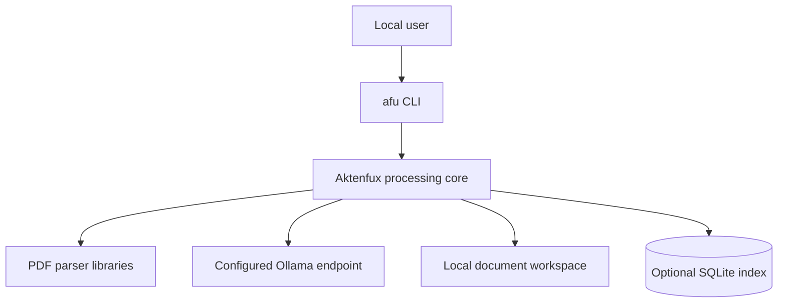
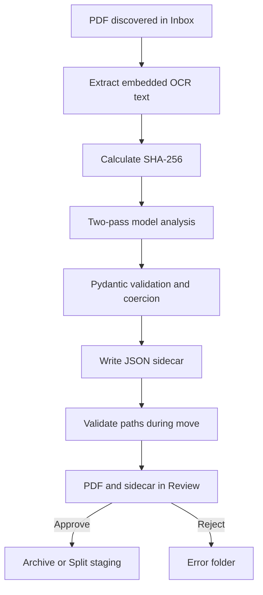
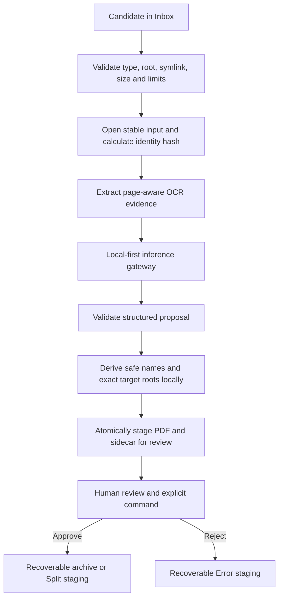
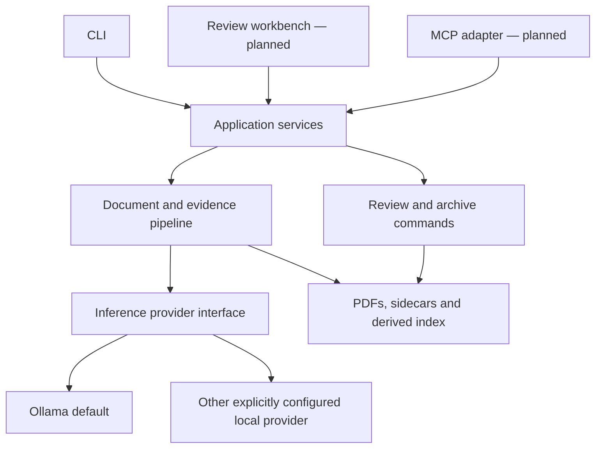

# Aktenfux architecture

Status: maintained current-state and target-state baseline  
Last reviewed: 2026-09-21  
Owner: project maintainers

Aktenfux is a local-first document processing and review workbench for OCR-ready
PDFs. It extracts embedded text, asks a configured inference provider for
structured proposals, validates those proposals, and stages documents for human
review before archival.

This document distinguishes the implementation currently present on `main` from
planned architecture. A planned box in a diagram is not a claim that the feature
already exists.

## ELI5

Aktenfux is like a careful clerk. You place a letter in an inbox. The clerk reads
it, writes a suggested label on a separate index card, and puts both into a
review tray. The clerk may suggest where the letter belongs, but only you may
approve moving it into the archive.

The letter is the original PDF. The index card is the sidecar JSON. The optional
SQLite database is only a catalogue: losing the catalogue must not mean losing
the letter or its authoritative index card.

## Architectural principles

1. **Local first.** Private document content stays on systems explicitly chosen
   by the operator. Local inference is the default security boundary.
2. **Human-controlled archival.** Analysis creates proposals; explicit approval
   performs permanent archival.
3. **Sidecar authority.** The JSON sidecar is the authoritative Aktenfux record
   for a document. SQLite is a derived index only.
4. **Untrusted inputs.** PDFs, OCR text, model output, sidecars, configuration,
   filenames, and synchronized-folder events are validated at their boundaries.
5. **Deterministic filesystem control.** Semantic model output may inform local
   naming functions, but it must not directly control filesystem paths.
6. **Recoverable operations.** File and sidecar changes must be observable,
   retryable, and recoverable after interruption.
7. **One application core.** CLI, review UI, and future MCP tools call the same
   application services rather than reimplementing file operations.
8. **Explainable limits.** Confidence is not certainty, a summary is not the
   source document, and a model suggestion is not a verified fact.

## Current system context

<!-- diagram: current-system-context -->

The CLI is the interface currently present on `main`. A browser workbench exists
separately as draft work and is not part of the current architecture. The
configured Ollama URL defaults to loopback, but the implementation currently
allows other URLs without an explicit remote-inference opt-in.

## Current processing flow

<!-- diagram: current-document-flow -->

This diagram deliberately reflects the current order. Source-path validation is
not performed before PDF extraction and hashing. A symlink or other unexpected
filesystem object in `_Inbox` may therefore be read before the later move check
rejects it. This is a documented security gap, not the intended target behavior.

Dry-run follows the analysis path without moving the original PDF. It writes a
sidecar to `_DryRun`. A likely multi-document scan is staged in `_Split` only
after approval; the current pipeline does not silently split it.

## Intended secure processing flow

<!-- diagram: target-document-flow -->

The target flow validates the source before reading it, separates model-proposed
semantics from trusted path derivation, preserves page-level evidence, and treats
the PDF plus sidecar as one recoverable document unit.

## Current components

| Component | Current responsibility | Boundary notes |
|---|---|---|
| `config.py` | Load configuration and construct workspace paths | Directory names and inference URL require stronger validation. |
| `pdf_text.py` | Extract embedded text with pypdf and optional pdfplumber | Processes hostile PDFs without explicit size/page/time limits. |
| `pdf_metadata.py` | Configurable PDF metadata rewriting | Disabled by default but currently opt-in through configuration; unsupported for the first release because it changes file bytes without refreshing the stored hash. |
| `llm.py` | Two-pass summarization and structured extraction | OCR and model output are untrusted; configured HTTP endpoint may be remote. |
| `ollama_manager.py` | Check, list, pull, and test models | Model downloads require confirmation; network boundary must remain explicit. |
| `schema.py` | Validate analysis and sidecar models | Validation normalizes shape, not factual correctness. |
| `filenames.py` | Generate and sanitize names | Must become the sole authority for trusted destination names. |
| `storage.py` | Hashing, sidecar I/O, path checks, and moves | Writes and paired moves are not currently transactional. |
| `db.py` | Optional status and duplicate index | Derived in principle; automatic rebuild is not implemented on `main`. |
| `main.py` | Processing, approve, reject, and reprocess orchestration | Mixes application policy and I/O sequencing. |
| `review.py` | Resolve and display review records | Sidecar data remains untrusted even when locally stored. |
| `cli.py` | User commands and terminal presentation | Bulk actions need explicit consequence handling. |

## Data ownership and recoverability

| Data | Authority | Rebuildable today? | Sensitivity and notes |
|---|---|---:|---|
| Original PDF | User-controlled filesystem | No | Primary private record; immutable by default. |
| Sidecar JSON | Aktenfux source of truth | No | Contains summaries, entities, paths, amounts, deadlines, and model proposals. |
| Markdown summary | Derived presentation | Yes, from sidecar | Optional and sensitive. |
| SQLite index | Derived index | Not automatically | Must contain no unique state; rebuild capability remains planned. |
| OCR text in memory | Derived transient data | Yes | Private; not stored in the sidecar by default. |
| Model response | Untrusted transient data | Yes | Debug logging may persist it when explicitly enabled. |
| PDF metadata | Optional embedded derivative | Only with care | Rewrites PDF bytes and may travel when the PDF is shared. |
| Archive layout | Human-approved organization | From PDF and sidecar | Wrong moves can still impose significant recovery cost. |

"Rebuildable in principle" is not the same as "rebuildable today." Until an
index rebuild command exists and is tested, loss or drift of SQLite requires
manual recovery even though no unique business state should live there.

## Trust boundaries

| Boundary | Trust transition | Required rule |
|---|---|---|
| Inbox filesystem → Aktenfux | External or synchronized files enter the process | Validate the resolved source, type, size, page count, and stability before parsing. |
| PDF bytes → parser | Complex hostile format enters dependency code | Bound resources, fail closed, and preserve the input. |
| OCR text → model prompt | Document content enters an instruction-following system | Treat all OCR instructions as quoted document data, never authority. |
| Model response → domain model | Probabilistic output becomes structured data | Validate shape, retain uncertainty, and distinguish proposal from fact. |
| Semantic proposal → filesystem | Suggested meaning influences file placement | Derive names locally and validate against the exact destination root. |
| Config → network endpoint | Operator configuration chooses data destination | Local-only by default; remote transfer requires explicit informed opt-in. |
| Sidecar → review decision | Generated or edited data influences the user | Show origin, evidence, confidence, warnings, and conflicts. |
| CLI/UI/MCP → application command | An interface requests state change | Centralize policy; preview and confirm consequential writes. |
| Workspace → sync/backup/export | Sensitive artifacts leave process control | Document confidentiality, race, retention, and recovery assumptions. |

## Application service boundary — planned

<!-- diagram: target-components -->

The application layer owns use cases such as scan, inspect, approve, reject,
reprocess, and later split. Interfaces present commands and results; they do not
move files, update sidecars, or decide authorization independently.

The future MCP adapter is a separate trust boundary. Its first release should
expose read-only inspection. Write tools require explicit, narrowly scoped
commands, exact document identifiers, previews, confirmation, audit events, and
no arbitrary filesystem or SQL access.

## Security and privacy baseline

The maintained [threat assessment](threat-model.md) defines assets, actors,
threats, required controls, verification, and release gates. Its controls are
requirements, not claims that they are already implemented.

The following architecture invariants apply:

- No input is trusted solely because it is inside `base_dir`.
- All source validation occurs before opening, parsing, hashing, or transmitting.
- All destination validation uses the exact allowed root for the operation.
- LLM output never directly authorizes a write or supplies a trusted path.
- No document enters `Archive` without an explicit human-approved command.
- Dry-run never moves or rewrites the original PDF.
- PDF bytes remain unchanged by default. Metadata rewriting is unsupported for
  the first release and requires a later ADR with coherent integrity and recovery
  semantics before it may be enabled.
- Sidecar updates and paired PDF/sidecar moves are atomic or recoverably journaled.
- SQLite contains no state that cannot be recovered from authoritative artifacts.
- Logs exclude OCR text, complete model responses, extracted values, and document
  paths by default.
- Planned interfaces do not become alternative sources of business logic.

## Quality attributes

| Attribute | Architectural response |
|---|---|
| Security | Exact-root confinement, local-first inference, hostile-input handling, explicit writes. |
| Privacy | Data minimization, local defaults, sensitive-artifact guidance, redacted telemetry. |
| Reliability | Atomic writes, recoverable commands, collision handling, stable IDs. |
| Explainability | Sidecars, evidence references, warnings, confidence, human review. |
| Portability | Python core, `pathlib`, no operating-system-specific core workflow. |
| Maintainability | Shared application services, typed models, ADRs, synchronized documentation. |
| Performance | Bounded parsing/inference, page-aware processing, resumable derived indexes. |

## Near-term decisions and delivery order

1. Adopt this documentation baseline and synchronize it with the implementation.
2. Fix pre-read source validation, exact-root validation, and deterministic path
   derivation.
3. Define atomic sidecar writes and recoverable paired moves.
4. Remove or keep disabled PDF metadata rewriting for the first release.
5. Add PDF resource limits and enforce local-only inference for the first release.
6. Implement and test SQLite rebuild before calling the index recoverable.
7. Introduce provider-neutral inference while retaining the local-only default.
8. Add page-level evidence and hierarchical long-document processing.
9. Connect the review workbench through application services.
10. Add MCP read tools, then separately review any proposed write tools.

Remote inference is outside the first-release boundary. Bulk approval, including
`approve --all`, must display the exact item count and require an additional
confirmation before any move begins.

Older branches and draft work must be reconciled before new layers are presented
as current functionality.

## Diagram maintenance

Named Mermaid blocks in this file and the threat model are the editable diagram
source. The renderer must discover each `<!-- diagram: name -->` block, validate it with a pinned
Mermaid version, and publish SVG artifacts in CI. Generated renderings are not
committed.

Update the relevant diagram whenever a component, trust boundary, persistence
mechanism, inference provider, interface, data authority, or material data flow
changes. The same pull request must update this document and the threat model
when their claims are affected.
