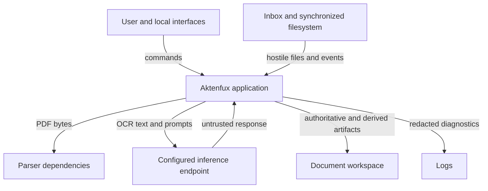

# Aktenfux threat assessment

Status: initial maintained assessment for the local MVP  
Last reviewed: 2026-09-21  
Owner: project maintainers

## Executive assessment

Aktenfux processes private documents, hostile PDF input, untrusted OCR text, and
probabilistic model output before performing filesystem operations. Its local,
human-controlled design is a strong starting point, but "local" is not itself a
security boundary and a review step cannot compensate for unsafe reads, writes,
or misleading presentation.

The dominant risks are:

1. **Reading outside the intended inbox** through symlinks or path races before
   source validation.
2. **Model-influenced filesystem actions** through prompt injection, generated
   paths, or tampered sidecars.
3. **Loss or inconsistency** when PDF and sidecar operations are interrupted.
4. **Private-data disclosure** through remote inference, logs, sidecars, metadata,
   synchronized folders, backups, or source control.
5. **Incorrect human decisions** caused by fabricated, truncated, stale, or
   insufficiently evidenced model output.
6. **Resource exhaustion or parser compromise** from hostile PDFs and dependency
   failures.

Until the first release gate is completed and verified, Aktenfux should be used
with copies or well-backed-up documents and careful manual review. This is a
design assessment, not a penetration test or a claim that every listed control
exists.

## Method and scoring

This assessment combines asset and trust-boundary analysis, STRIDE, CIA impact,
privacy harms, and Aktenfux-specific abuse and failure cases.

- **Critical** — may read or change data outside the intended workspace, cause
  systematic archive corruption, or defeat the human-control boundary.
- **High** — may disclose private document data, materially alter authoritative
  artifacts, or cause a consequential incorrect decision.
- **Medium** — meaningful but constrained impact, or a prerequisite for a larger
  failure.
- **Low** — limited impact with straightforward detection and recovery.

Ratings are inherent risk before required controls. Implementing one control
does not silently lower a rating; residual risk must be reassessed explicitly.

## Scope and assumptions

In scope:

- CLI commands and core processing pipeline;
- configuration and workspace layout;
- PDF parsing and optional PDF metadata writing;
- two-pass inference and model management;
- sidecar JSON and optional Markdown summaries;
- optional SQLite index and duplicate detection;
- review, approval, rejection, reprocessing, and split staging;
- synchronized local folders, logs, backups, and repository hygiene;
- planned review UI and MCP boundaries where they affect current design.

Assumptions:

- Aktenfux initially runs for one user on a trusted personal workstation.
- Every PDF, filename, symlink, OCR string, model response, sidecar, and sync
  event may be malformed, malicious, misleading, or stale.
- A local user account, LAN address, or file location does not automatically make
  its content trustworthy.
- The user remains the final decision-maker for archival.
- The document workspace is separately backed up; Aktenfux is not a backup
  system.
- Multi-user and network-accessible deployments are unsupported until explicitly
  designed and gated.

## Assets and security objectives

| Asset | Confidentiality | Integrity | Availability |
|---|---|---|---|
| Original PDFs | Critical: may contain personal, health, financial, or legal data | Critical: originals and provenance must remain trustworthy | High |
| OCR text | Critical | High: manipulated text can mislead analysis | Medium |
| Sidecar JSON | High | Critical: authoritative Aktenfux state and review evidence | High |
| Archive and staging layout | High | Critical: placement and lifecycle state must be correct | High |
| SQLite index | High | Medium: must not contradict authoritative artifacts | Medium |
| Model prompts and responses | High | High: may shape consequential proposals | Medium |
| Configuration | High | Critical: chooses paths, endpoints, and safety modes | High |
| Logs and diagnostics | High | High: must remain attributable and non-misleading | Medium |
| Backups and synchronized copies | Critical | Critical | High |
| Application code and dependencies | Medium | Critical | High |

## Actors

- legitimate user making a mistake;
- person or system supplying a hostile PDF;
- compromised scanner, sync client, local process, or inference endpoint;
- malicious or defective model producing unsafe or misleading output;
- dependency or build supply-chain attacker;
- future UI, API, or MCP client acting with excessive capability;
- person who obtains an exported PDF, sidecar, log, backup, or repository copy.

The model is not an authorized actor. It produces untrusted proposals.

## Trust boundaries

The key transitions are:

- filesystem object to opened input;
- PDF bytes to parser code;
- OCR text to instruction-following model;
- model output to validated proposal;
- proposal or sidecar to filesystem target;
- configuration to network destination;
- interface request to consequential command;
- workspace artifact to sync, backup, export, or source control.

## Threat register

### ELI5

Think of Aktenfux as a clerk handling private letters. A letter may be damaged,
may contain instructions addressed to the clerk, or may lie about what it is.
The clerk's index card may also be wrong or altered. We protect the letters, the
cards, the route between trays, and the rule that only the owner approves the
final archive.

- **STRIDE:** pretending to be someone (S), changing things improperly (T),
  denying responsibility (R), revealing secrets (I), blocking service (D), or
  gaining extra powers (E).
- **Risk:** inherent seriousness before required controls.
- **Required controls:** work that must exist; listing it is not proof it exists.
- **Verification:** evidence needed before calling the control effective.

| ID | ELI5 | Threat and abuse case | STRIDE | Risk | Required controls | Verification |
|---|---|---|---|---|---|---|
| AF-01 | A paper in the inbox is really a sign pointing to a private file somewhere else. | A symlink, junction, special file, or escaped configured directory is opened, parsed, or hashed before source confinement is checked. | I/E | Critical | Validate configured directories at load; require a regular file; resolve and confine source to the exact inbox before any read; reject links and recheck an opened-file identity where supported. | Symlink, junction, absolute-path, `..`, special-file, and platform-specific tests proving parser and hasher are never called. |
| AF-02 | A deliberately broken or enormous letter jams or harms the machine that tries to read it. | Malformed, compressed, encrypted, or oversized PDFs exploit parser defects or exhaust CPU, memory, disk, or time. | D/E/I | High | Size/page/encryption limits; parse timeout or isolated worker; dependency patching; bounded fallback; preserve input and fail safely. | Malformed corpus, size/page boundary tests, timeout/cancellation tests, dependency scanning. |
| AF-03 | The letter says, “Ignore your owner and write a different label,” and the clerk obeys. | Hidden or visible OCR prompt injection changes summaries, deadlines, integrity assessment, categories, or warnings. | T/R | High | Delimit OCR as untrusted content; instruction-hierarchy prompts; model output remains advisory; evidence references; prominent uncertainty/conflict display; adversarial tests. | Injection corpus covering hidden OCR, fake system messages, deadline suppression, split suppression, and fabricated actions. |
| AF-04 | The suggested label secretly contains directions to another drawer. | LLM output or a tampered sidecar supplies absolute paths, separators, traversal, reserved names, or wrong lifecycle roots. | T/I/E | Critical | Ignore model path strings for writes; derive names locally from bounded semantic fields; validate exact destination root; validate sidecars on every use; no overwrite. | Cross-platform malicious-name corpus and tests for every scan/approve/reject/reprocess destination. |
| AF-05 | The “local helper” is actually in another building, so every private letter is carried there. | A copied or modified `ollama_url` sends OCR text and summaries to a LAN or internet endpoint, possibly over plaintext HTTP. | I/S | High | Loopback-only default enforcement; explicit remote opt-in; strong warning and endpoint display; TLS/auth requirements for any supported remote mode; never market remote mode as local. | URL parser tests for IPv4/IPv6/hostname tricks, redirects, proxies, DNS changes, and clear CLI acceptance tests. |
| AF-06 | The letter moves but its index card does not, or the card is half-written when the power fails. | Sidecar writes can truncate authoritative state; sequential PDF/JSON/Markdown moves can leave partial or contradictory state after interruption. | T/R/D | High | Atomic temp-write, fsync where appropriate, replace, operation journal or recoverable state machine, idempotent retry, startup reconciliation, collision-safe rollback. | Fault injection after every write/move step; restart/retry/reconciliation tests on supported filesystems. |
| AF-07 | The clerk changes the letter after sealing it, so the recorded seal no longer matches. | Optional PDF metadata rewriting changes file bytes after SHA-256 is recorded, leaving the sidecar hash stale and invalidating duplicate/provenance assumptions. | T/R | High | Decide whether hash identifies original bytes or current artifact; preserve original hash plus derivative hash, or rehash atomically; record transformation and tool version; keep feature off until defined. | Round-trip metadata tests, hash assertions, interruption recovery, and sharing/export inspection. |
| AF-08 | Someone edits the index card and the clerk treats the edit as trusted history. | Sidecar JSON is authoritative but has no authenticity, revision, or provenance mechanism; tampering may change status, paths, model claims, or approval input. | T/R | High | Strict schema and lifecycle validation; locally derived paths; revision history or append-only events for consequential actions; optional integrity manifest; distinguish human edits from model output. | Tampered-sidecar corpus, invalid transition tests, provenance reconstruction, and recovery tests. |
| AF-09 | The catalogue says a letter exists in one drawer while the letter and card say another. | Optional SQLite drifts from sidecars; failed updates or missing rebuild make status and duplicate detection incomplete or misleading. | T/R | Medium | Sidecar-first reads for authority; transactional projection updates where possible; tested full rebuild and reconciliation; surface stale/degraded index state. | Delete/corrupt/rebuild tests, stale-row removal, folder-wide reconciliation, and duplicate scenarios with SQLite disabled. |
| AF-10 | Private details are copied onto a noticeboard while someone is troubleshooting. | Sidecars, Markdown, SQLite, raw model output, paths, config, PDF metadata, logs, test fixtures, or runtime folders leak through sharing, sync, backups, telemetry, or Git. | I | High | Sensitive-data classification; safe `.gitignore`; redacted logging by default; explicit debug warning; no production documents in tests/issues; backup/export guidance; secret scanning. | Repository/runtime scanning, log-capture tests, package inspection, and manual export/privacy review. |
| AF-11 | While the clerk reads a letter, another helper silently swaps it for a different one. | Sync software or another process modifies/replaces the PDF between validation, parsing, hashing, sidecar creation, and move (TOCTOU). | T/R | High | Stable file handle or controlled staging copy; pre/post identity checks; settle/lock policy; detect changed size/mtime/hash; retry without overwriting evidence. | Concurrent replacement, rename, and sync-conflict tests with deterministic failure behavior. |
| AF-12 | The clerk reads only the first pages and misses the payment deadline or the second letter. | Character truncation or weak OCR omits decisive evidence while summaries appear complete and confident. | T/R | High | Page-aware extraction; explicit truncation warning in sidecar/UI; hierarchical long-document analysis; citations; confidence tied to coverage; manual review gate. | Long-document corpus with facts at the end, page boundary cases, poor OCR, and multi-document scans. |
| AF-13 | One broad command empties the whole review tray before the owner notices. | `--all`, future UI actions, automation, or MCP tools perform large or destructive changes with insufficient preview, scoping, confirmation, or audit. | T/R/E | High | Separate read/write capabilities; count and exact-item preview; explicit confirmation; bounded batches; idempotency; audit event; no arbitrary path/SQL/file tools. | Confirmation and cancellation tests, partial-failure recovery, replay tests, and MCP permission matrix. |
| AF-14 | A tool used to read letters has been secretly replaced with a harmful one. | Python dependency, package, CI action, model artifact, or build process compromises document confidentiality or integrity. | T/I/E | High | Minimize and pin dependencies/actions; provenance review; dependency/SAST/secret scanning; hashes/signatures where available; documented model provenance. | Clean rebuild, lockfile review, vulnerability gates, action pin checks, and model-change review. |
| AF-15 | The spare archive is stolen, or restoring it brings back mismatched letters and cards. | Backups or synchronized copies disclose private data or restore incomplete, stale, or internally inconsistent document units. | I/T/D | High | Encrypted restricted backups; integrity manifest; include all authoritative artifacts; documented restore; isolated restore rehearsal; reconciliation before reuse. | Scheduled restore drill covering PDF/sidecar pairs, configuration, permissions, and index rebuild. |

## Implemented controls and known limits

The current implementation includes useful controls:

- `dry_run` defaults to true;
- documents are staged in `_Review` before approval;
- probable multi-document scans are staged for follow-up rather than split silently;
- Pydantic validates and normalizes the model response shape;
- path resolution prevents moves outside `base_dir`;
- destination collision handling avoids overwriting existing files;
- SHA-256 is recorded and can support duplicate detection;
- SQLite statements bind data values;
- PDF metadata writing is disabled by default;
- full OCR text is not stored in sidecars by default;
- model downloads require confirmation.

These controls have important limits:

- source paths are not confined before parsing and hashing;
- `base_dir` confinement is weaker than exact lifecycle-root confinement;
- non-empty LLM path suggestions can still influence destinations;
- paired artifact moves and sidecar writes are not transactional;
- duplicate detection currently depends on optional SQLite;
- SQLite rebuild is not implemented on `main`;
- remote inference is not blocked by default;
- PDF parsing has no explicit size, page, or execution limits;
- debug mode may log complete model responses containing private data;
- PDF metadata rewriting can invalidate the recorded hash.

Documentation must never describe a limited control as if the stronger target
control were already implemented.

## Security invariants

- A model response is a proposal, never authorization.
- A source is validated against the exact inbox root before any content access.
- A destination is derived and validated against the exact root for its command.
- No command overwrites an existing PDF, sidecar, or Markdown artifact.
- No document enters `Archive` without explicit human approval.
- Dry-run does not move or rewrite the original PDF.
- Original, current, and transformed artifact hashes have explicit meanings.
- Sidecar authority never permits unique state to live only in SQLite.
- Consequential state transitions are attributable, idempotent, and recoverable.
- Logs and errors omit document content and extracted values by default.
- Local-first is enforced technically, not inferred from product wording.
- UI and MCP adapters cannot bypass application-level checks.
- A similarity, confidence, or model score is not described as a probability
  unless it is calibrated and verified as one.

## Release gates

### ELI5

These are the checks before we trust the clerk with more responsibility:

- **Sensitive documents:** prove the clerk reads only the intended inbox, cannot
  choose arbitrary drawers, and can recover when interrupted.
- **Remote inference:** tell the owner that a letter will leave the machine,
  protect the journey, and verify the destination.
- **GUI or MCP writes:** ensure every interface uses the same rules, shows the
  exact consequence, and asks before consequential changes.
- **Automatic splitting:** prove no page is lost and the original remains
  recoverable before allowing automation to create new documents.

The technical lists below define the actual gates.

### Before regular use with sensitive documents

- source type, symlink, and exact-root checks before any read;
- exact destination-root checks for every lifecycle command;
- deterministic local filename and folder derivation;
- atomic sidecar writes and tested recovery for paired moves;
- coherent hash semantics, with PDF metadata writing disabled until satisfied;
- loopback-only inference enforced by default;
- PDF size/page/time controls and safe parser failure;
- runtime/config ignore rules and sensitive-artifact documentation;
- redacted default logging and an explicit sensitive-debug warning;
- backup and restore procedure tested with PDF/sidecar pairs;
- tests for prompt injection, path attacks, interruption, and dry-run invariants.

### Before allowing remote inference

- explicit configuration opt-in separate from the endpoint URL;
- clear user-facing disclosure of which data is transferred;
- authenticated encrypted transport and endpoint identity validation;
- redirect, proxy, DNS, timeout, and response-size controls;
- documented retention, logging, and operator trust assumptions;
- a threat-model update for each supported provider or deployment pattern.

### Before GUI or MCP write capabilities

- application services own all state transitions and policy;
- read-only and write capabilities are separately configurable;
- writes expose narrow commands, exact identifiers, preview, and confirmation;
- bulk actions show count and item scope and use bounded batches;
- no arbitrary filesystem, shell, SQL, or model-prompt execution tools;
- idempotency, audit records, cancellation, and partial-failure recovery;
- loopback binding or authenticated transport appropriate to the deployment;
- negative tests proving adapters cannot bypass core invariants.

### Before automatic or physical splitting

- page-level source identity and evidence model;
- original PDF preservation and explicit output provenance;
- no page loss, duplication, or silent reordering;
- deterministic retry and collision behavior;
- human review of proposed boundaries before irreversible replacement;
- end-to-end backup, restore, and reconciliation tests.

## Verification programme

- cross-platform path and symlink tests on Windows, Linux, and macOS;
- property tests for lifecycle transitions, collision handling, and path roots;
- fault injection across sidecar writes and multi-artifact moves;
- malformed and adversarial PDF corpus with resource limits;
- prompt-injection and misleading-document corpus;
- page-coverage tests for truncation and multi-document recognition;
- concurrency tests for sync replacement and repeated commands;
- index rebuild and reconciliation tests;
- privacy tests for logs, errors, exports, package contents, and PDF metadata;
- dependency, secret, static-analysis, and workflow-pinning checks in CI;
- manual abuse-case review whenever a boundary or automation level changes.

## Detection, containment, and recovery

Security and recovery events should record command type, opaque document ID,
source lifecycle state, destination lifecycle state, outcome, correlation ID,
application version, and UTC time. They should not record OCR text, summaries,
entities, amounts, full paths, or raw model output by default.

Detect and surface:

- rejected path or symlink attempts;
- files that change during processing;
- repeated parser/inference failures;
- remote endpoint configuration;
- incomplete artifact pairs or journal entries;
- sidecar/hash mismatch;
- stale or unreconciled SQLite state;
- unusual bulk approvals, rejections, or reversals;
- unexpected debug logging or runtime artifacts inside the repository.

Containment must support stopping scans, disabling inference, disabling write
adapters, quarantining a document without deleting it, and rebuilding derived
state. Recovery must reconcile PDFs and sidecars before rebuilding SQLite.

## Residual risks

Even with the required controls, Aktenfux remains dependent on PDF parser safety,
model quality, OCR quality, workstation security, storage and backup security,
and careful human review. A correct local system can still produce a convincing
but wrong summary. Human approval reduces automation risk but does not transform
model output into verified fact.

Writing summaries, tags, or correspondents into PDF metadata increases the
chance that private derived information travels with an exported document. That
risk remains even when the write is technically correct.

## Maintenance

Update this assessment whenever a component, trust boundary, data class,
filesystem lifecycle, parser, inference provider, model family, sidecar schema,
logging policy, backup/export path, UI, MCP tool, or automation level changes.

Every material pull request must state:

- architecture impact;
- threat-model impact, including affected threat IDs;
- diagram impact;
- data and privacy impact;
- release-gate impact;
- ADR impact.

“None” requires a short justification. A security-sensitive feature is
incomplete when its documentation or verification requirement is stale, even if
functional tests pass.

## References

- [Architecture](architecture.md)
- [ELI5 guide](eli5.md)
- [ADR 0001: Local-first, human-controlled archival](decisions/0001-local-first-human-controlled-archive.md)
- NIST SP 800-207, Zero Trust Architecture
- OWASP File Upload Cheat Sheet
- OWASP Path Traversal guidance
- OWASP LLM Prompt Injection Prevention Cheat Sheet

